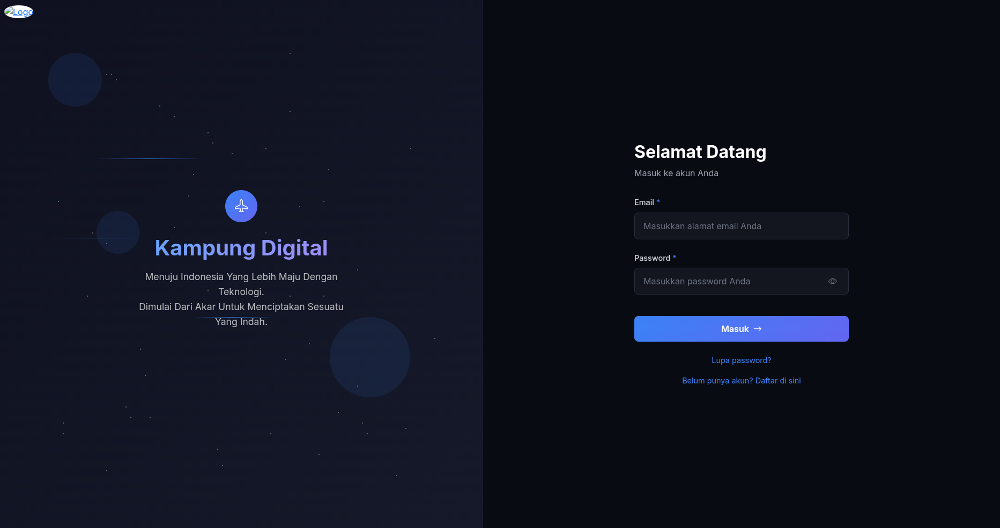
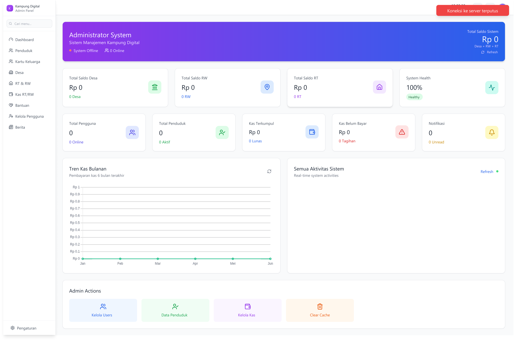
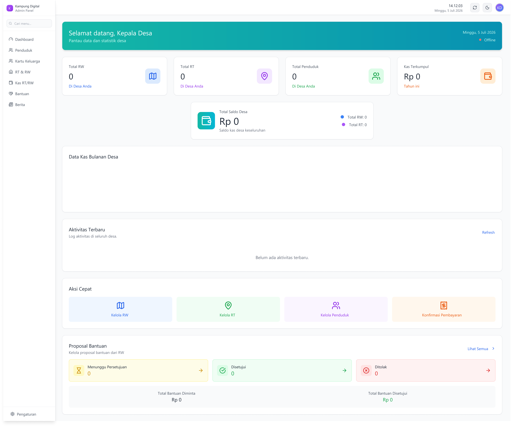
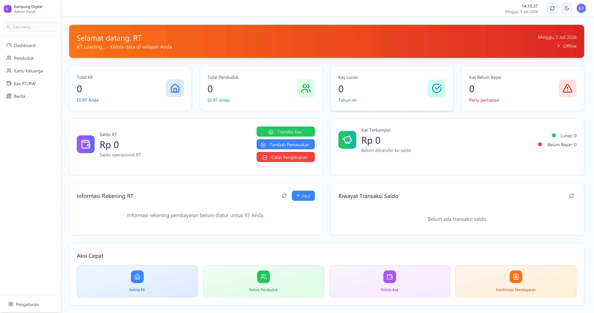
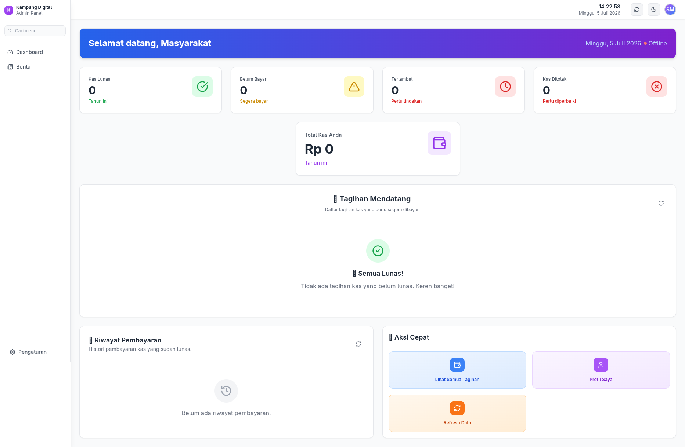
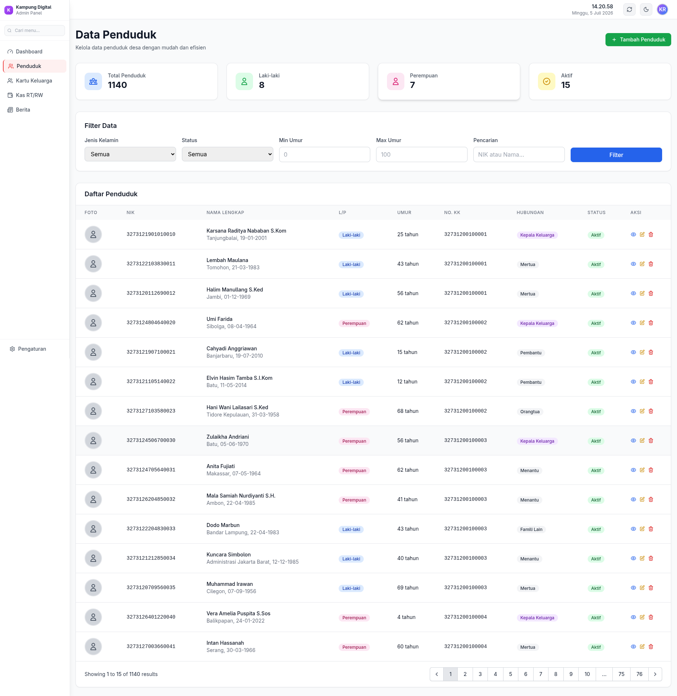
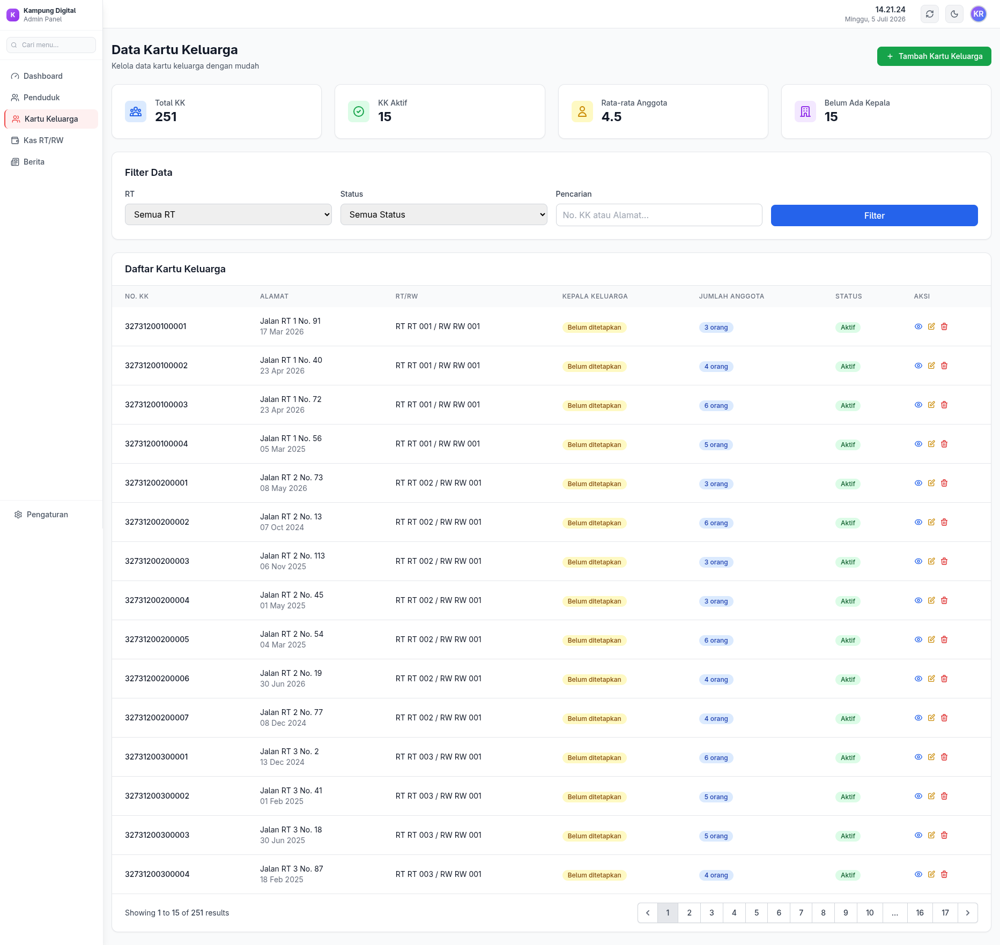
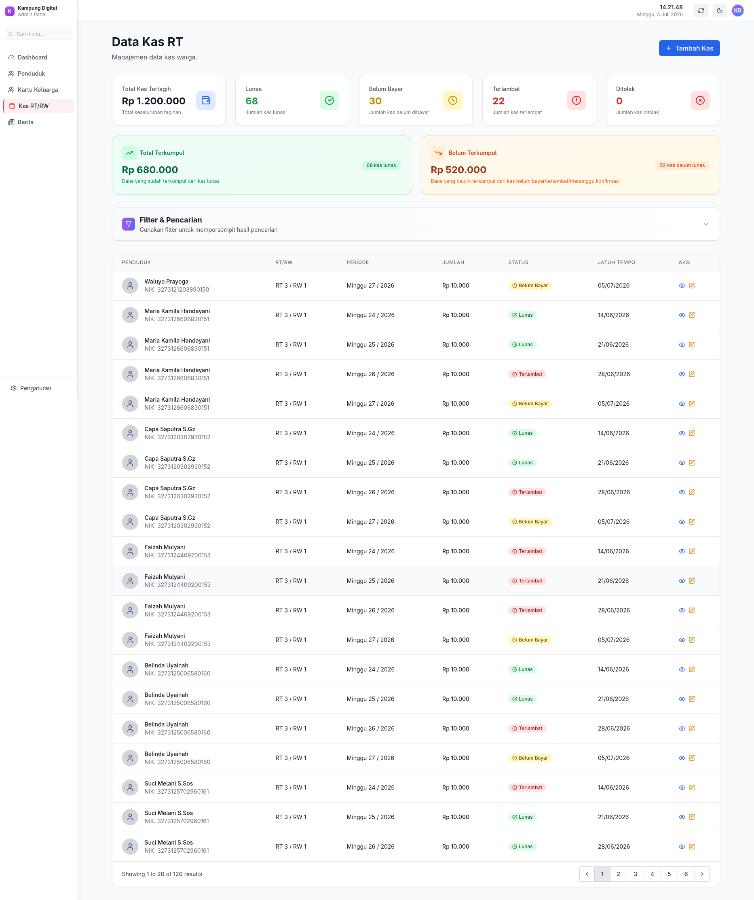
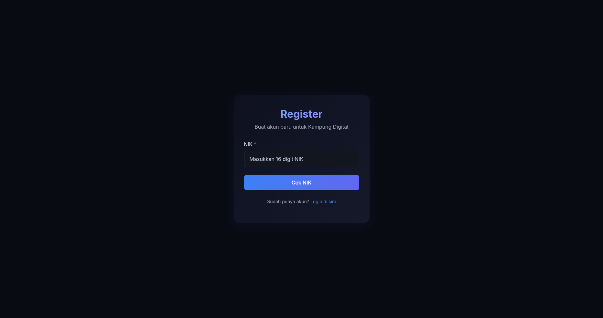

# KampungDigital

Aplikasi manajemen desa berbasis Laravel 12 untuk mengelola data desa, RT/RW, penduduk, kas, pembayaran, dan proposal bantuan.

## Penjelasan Aplikasi

`KampungDigital` adalah sistem informasi terintegrasi untuk:

- **Manajemen Administratif**: Desa, RW, RT, Penduduk, dan KK
- **Manajemen Kas**: Pencatatan kas RT/RW dan pembayaran iuran mingguan
- **Pembayaran**: Konfirmasi pembayaran dengan berbagai metode (tunai, transfer, e-wallet, QR code)
- **Notifikasi**: Pengingat pembayaran dan pemberitahuan penting
- **Proposal Bantuan**: Pengajuan dan review proposal bantuan sosial
- **Laporan**: Dashboard dan analitik per role

## Role dan Akses

Aplikasi memiliki 5 role dengan akses berbeda:

### 1. **Admin** (`admin@kampungdigital.test`)
- Akses penuh ke semua fitur
- Manajemen pengguna dan pengaturan sistem
- Dashboard admin dengan statistik keseluruhan

**Password**: `password`

### 2. **Kepala Desa** (`kades@kampungdigital.test`)
- Mengelola proposal bantuan (approve/reject)
- Melihat laporan kas desa
- Manajemen RW dan RT
- Dashboard kades dengan ringkasan kegiatan

**Password**: `password`

### 3. **RW** (Rukun Warga)
- **Email**: `rw1@kampungdigital.test`, `rw2@kampungdigital.test`, `rw3@kampungdigital.test`
- Membuat dan mengelola RT
- Mengajukan proposal bantuan
- Melihat laporan kas RW
- Dashboard RW dengan statistik

**Password**: `password` (sama untuk semua RW)

### 4. **RT** (Rukun Tetangga)
- **Email**: `rt1@kampungdigital.test`, `rt2@kampungdigital.test`, ..., `rt5@kampungdigital.test`
- Mengelola data penduduk dan KK di RT
- Mencatat kas mingguan
- Konfirmasi pembayaran kas
- Dashboard RT dengan statistik

**Password**: `password` (sama untuk semua RT)

### 5. **Masyarakat**
- **Email**: `user1@kampungdigital.test`, `user2@kampungdigital.test`, ..., `user15@kampungdigital.test`
- Melihat data diri dan keluarga
- Membayar iuran kas RT
- Melihat notifikasi pembayaran
- Dashboard pribadi

**Password**: `password` (sama untuk semua user)

## Instalasi & Setup

1. Clone repository
2. Install dependency:
   ```bash
   composer install
   npm install
   ```
3. Buat file `.env` dari `.env.example`
4. Generate APP_KEY:
   ```bash
   php artisan key:generate
   ```
5. Konfigurasi database di `.env` (gunakan MySQL untuk import wilayah):
   ```env
   DB_CONNECTION=mysql
   DB_HOST=127.0.0.1
   DB_DATABASE=kampung_digital
   DB_USERNAME=root
   DB_PASSWORD=
   ```
6. Jalankan migrasi + seeder:
   ```bash
   php artisan migrate:fresh --seed
   ```
7. Jalankan server:
   ```bash
   php artisan serve
   npm run dev
   ```

Akses aplikasi di `http://127.0.0.1:8000`

## Data Seeder

Seeder otomatis mengisi data:

- **Wilayah Indonesia**: Provinsi, Kabupaten, Kecamatan, Desa (dari `database/seeders/wilayah_indonesia.sql`)
- **20 Desa** dengan lokasi acak
- **3 RW per Desa** (total 60 RW)
- **3 RT per RW** (total 180 RT)
- **20 KK per RT** (total 3600 KK)
- **50 Penduduk** dengan distribusi acak
- **Pengguna per Role**: 1 admin, 1 kades, 3 RW, 5 RT, 15 masyarakat
- **Pengaturan Kas Global**: jumlah mingguan Rp 10.000, denda 2%, batas bayar 7 hari
- **Metode Pembayaran per RT**: Bank BRI, Dana, GoPay, OVO, ShopeePay, QR Code
- **8 Proposal Bantuan** dalam berbagai status (pending, approved, rejected)
- **20 Notifikasi** untuk berbagai user

## Test Credentials

Gunakan kombinasi email + password di atas untuk login dan test aplikasi.

### Contoh Login:
- **Admin**: `admin@kampungdigital.test` / `password`
- **Kades**: `kades@kampungdigital.test` / `password`
- **RW 1**: `rw1@kampungdigital.test` / `password`
- **RT 1**: `rt1@kampungdigital.test` / `password`
- **User 1**: `user1@kampungdigital.test` / `password`

## Perintah Penting

```bash
# Reset database dan jalankan seeder
php artisan migrate:fresh --seed

# Jalankan seeder saja (tanpa reset)
php artisan db:seed

# Clear cache
php artisan config:clear
php artisan cache:clear

# Jalankan server
php artisan serve

# Compile frontend assets
npm run dev
npm run build
```

## Catatan

- Pastikan database MySQL sudah dibuat sebelum migrate
- Seeder `wilayah_indonesia.sql` hanya kompatibel dengan MySQL/MariaDB (bukan SQLite)
- Semua user menggunakan password `password` untuk testing
- Data di-generate secara acak, bisa jalankan ulang `migrate:fresh --seed` untuk data baru
 
## Screenshots

Berikut screenshot dari aplikasi yang dijalankan pada lingkungan development lokal. Semua file ada pada folder `image/` di repository.

- **Login**

   

   *Penjelasan:* Halaman login aplikasi. Masukkan email dan password (contoh: `admin@kampungdigital.test` / `password`) untuk mengakses dashboard sesuai peran.

- **Landing Page**

   

   *Penjelasan:* Halaman depan publik (landing) berisi ringkasan dan tautan masuk ke panel admin dan user.

- **Dashboard Admin**

   

   *Penjelasan:* Dashboard untuk role `admin`. Menampilkan statistik keseluruhan sistem (total pengguna, total penduduk, saldo sistem, laporan kas, dan aktivitas terbaru).

- **Dashboard Kepala Desa (Kades)**

   

   *Penjelasan:* Dashboard untuk `kades` menampilkan ringkasan desa, status proposal bantuan, dan statistik kas desa.

- **Dashboard RW**

   

   *Penjelasan:* Dashboard untuk ketua RW. Menampilkan statistik per-RW, daftar RT dalam wilayah RW, dan ringkasan kas RW.

- **Dashboard RT**

   

   *Penjelasan:* Dashboard untuk ketua RT. Menampilkan total KK, total penduduk di RT, saldo operasional RT, serta informasi kas yang perlu ditindaklanjuti. Perhatikan indikator status koneksi (Online/Offline) dan notifikasi jaringan jika ada error.

- **Dashboard Masyarakat**

   

   *Penjelasan:* Tampilan untuk pengguna masyarakat. Menunjukkan tagihan kas pribadi, riwayat pembayaran, dan notifikasi terkait pembayaran.

- **Data Penduduk (index)**

   

   *Penjelasan:* Halaman daftar penduduk dengan fitur pencarian dan filter; klik baris untuk membuka detail penduduk.

- **Kartu Keluarga (KK) / Data KK**

   

   *Penjelasan:* Halaman Kartu Keluarga menampilkan anggota keluarga, nomor KK, dan kepala keluarga. Berguna untuk manajemen keluarga dan penentuan RT/RW.

- **Data Kas**

   

   *Penjelasan:* Modul kas menampilkan daftar transaksi kas, jumlah kas terkumpul, dan status pembayaran (lunas, belum bayar, terlambat, ditolak).

- **Register (contoh form)**

   

   *Penjelasan:* Contoh form pendaftaran pengguna (register). Sistem mendukung alur verifikasi OTP untuk pendaftaran akun masyarakat.

